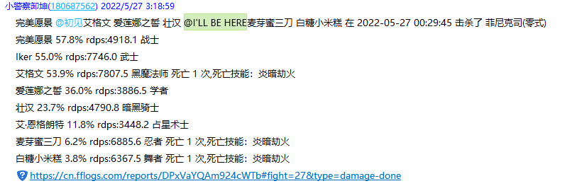
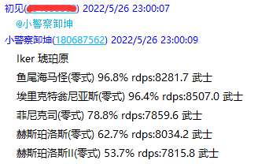
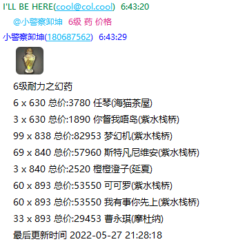

# Lailai

[](https://github.com/Cherrs/Lailai/actions/workflows/rust.yml)

- 基于 ricq 开发的 FF14 开箱即用机器人

- 配置简单

支持的存储:

- [x] postgresql
- [x] sled(local)
- [ ] mysql
- [ ] ~~leveldb~~

开发环境：rust nightly

## 使用Lailai

到[Release](https://github.com/Cherrs/lailai/releases)下载对应平台的可执行文件

1. 打开后选择二维码登录。
2. 确保登录qq和扫码设备在同一网络下
3. 扫码

> - 账号密码登录需要滑块ticket，建议扫描二维码登录
> - 没有配置`group_config.yaml`默认不启用查询logs
> - 若无法登录，尝试删除目录下`session.key`和`device.json`文件

## 配置

- 所有配置文件放在`config`目录下
- Lailai会优先使用`config/config.yaml`文件的配置
- 如果`config/config.yaml`文件不存在则使用环境变量
- 如果都没有配置则禁用fflogs相关功能

### 基础配置

config.yaml

``` yaml
store: local
rsconstr: postgres://{数据库用户名}:{密码}@{ip}:{port}/{库名}
logskey: appkey
interval: 120
localpath: db/cache
historydays: 1
openai: openai key
```

- `store` 使用哪一种缓存，默认local
  - `local` 使用[sled](https://github.com/spacejam/sled)的本地存储
  - `postgres` 使用postgresql，创建脚本在sql文件夹下
- `rsconstr` postgresql数据库配置
- `logskey` fflogs的V1 Client Key
- `interval` 重试间隔，单位是秒，默认60
- `localpath` 本地存储位置，默认`db/cache`
- `historydays` 通报的历史天数，默认为1，1天前的数据不会通报
- `openai` OpenAI的Key，支持AI回复

### 配置群消息

group_config.yaml

``` yaml
- qq: {qq号，是0则永远不会at}
  name: {角色名}
  server: {服务器}
  group: 
    - id: {群号1}
    - id: {群号2}
```

例：

``` yaml
- qq: 694638502
  name: Iker
  server: 琥珀原
  group: 
   - id: 136610715
```

Lailai会检索Iker在logs上的数据，如有更新并且击杀时间`historydays`之后会发送到群136610715，如果配置的QQ号：694638502在群里会自动At

## fflogs警察 实时发送logs数据到群

- 从<https://www.fflogs.com/>获取数据
- 如果发送的玩家在群会自动at
- 不建议非亲友群使用，注意保护玩家隐私
- 使用时注意logs的请求限制，可以通过调整interval和捐赠logs来支持更多玩家



## 指令

指令格式为：`@机器人 {参数} {命令}`

目前支持的命令：

- [x] `@机器人` 不带参数命令At机器人，查询玩家logs数据
- [x] `物品` 模糊搜索物品
- [x] `价格` 检索物品价格
- [ ] 生产相关功能

### 查询自己的logs

`@小警察卸坤`

- 此功能需要在`group_config.yaml`里配置qq号，角色名，服务器



### 模糊搜索物品

`@小警察卸坤 6级药 物品`


### 搜索物品价格

`@小警察卸坤 6级耐力之幻药 价格`


